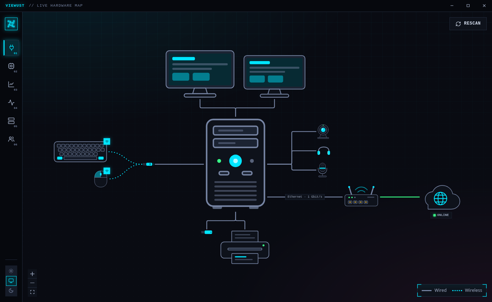
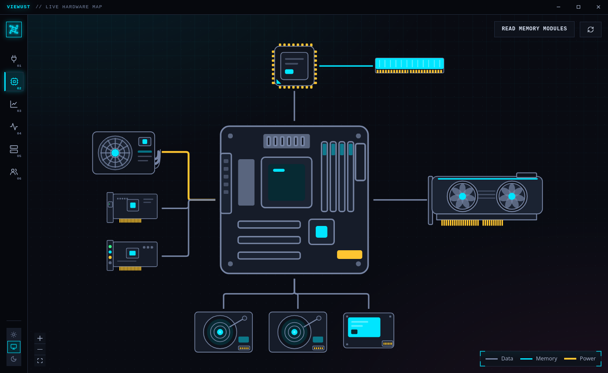
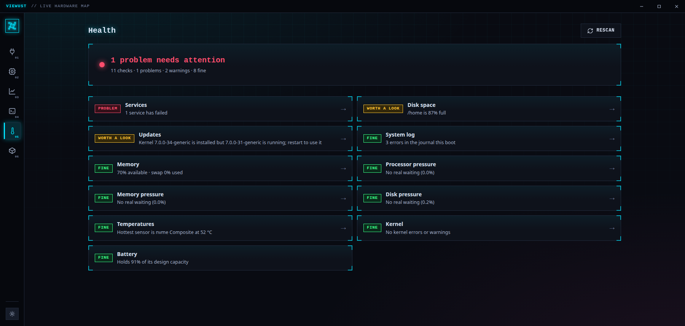
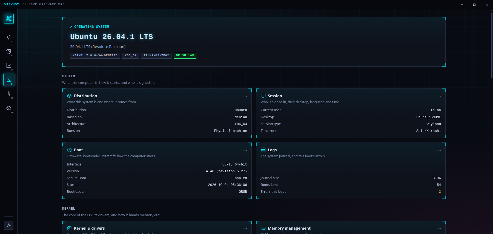

# Viewust

See your computer. Everything plugged in, everything inside it, and everything it is doing —
on one live map.

## Install

Download one file from the [Releases page](https://github.com/htmujahid/viewust/releases) and:

- **Ubuntu, Debian, Mint** — `sudo apt install ./viewust_*.deb`
- **Fedora, openSUSE** — `sudo dnf install ./viewust-*.rpm`
- **Arch** — `sudo pacman -U ./viewust-*.pkg.tar.zst`
- **Any other Linux** — make the `.AppImage` executable and double-click it. Nothing gets installed.

That's it. Open _Viewust_ from your app launcher.

## What you can see

- **Your devices** — keyboard, mouse, monitors, drives, webcam… drawn to scale on a live map,
  with the route from your computer to the internet. Click anything for the full story.

- **Inside the case** — motherboard, processor, memory, drives, graphics card, fans and the
  power supply, laid out the way they are really connected.

  

- **Is it healthy?** — one page, one verdict: failed services, full disks, overheating,
  memory pressure, pending restarts. Green means go.

  

- **The operating system** — from the moment the power button is pressed to the programs on
  screen: boot, kernel, processes, files, network, users, security — each with its own page.

  

- **Live monitor** — processor, memory, storage, graphics, temperatures, power, network and
  audio, charted second by second. Includes an internet speed test.

- **Disk usage** — every drive as a tree: open it folder by folder and see what is taking
  the space. Drives that aren't mounted get a Mount button.

_Screenshots show sample data, not a real machine._

## Good to know

- **Right-click is everywhere.** Any device, program, service or file row has a menu: watch it
  live, copy its details, stop a program, restart a service, unmount a drive.
- **It looks, it doesn't touch.** Everything is read without administrator rights. The few
  actions that change something always ask first, and the risky ones ask for your password.
- **Nothing leaves your computer.** The one exception is the internet speed test, which only
  runs when you press its button.
- **Honest about gaps.** If your hardware doesn't report something, Viewust says so instead
  of guessing.

## Platforms

Linux only, by design — Viewust reads the system directly to show far more than a
cross-platform app could.

---

Built with [Tauri 2](https://tauri.app) and [SvelteKit](https://svelte.dev) ·
developers start at [docs/ARCHITECTURE.md](docs/ARCHITECTURE.md)
